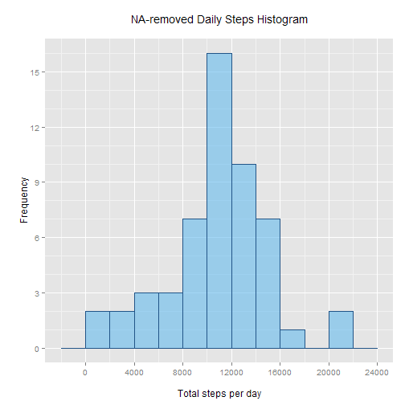
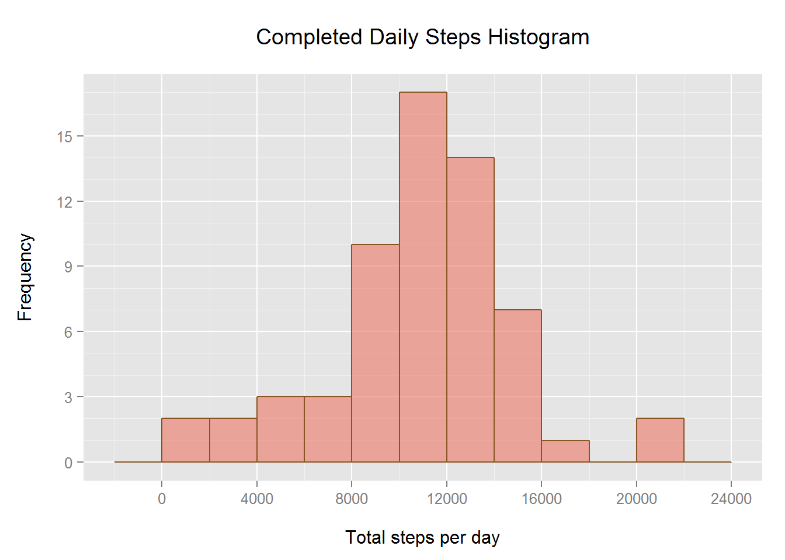
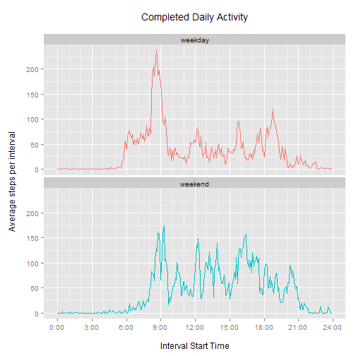

## Introduction  

Activity monitoring devices are growing in popularity, but the question of how to use and interpret the collected data remains somewhat open-ended.

In this article, we perform a case study using "number of steps" data from an anonymous individual collected during October and November 2012. We'll attempt to answer a few basic questions with the aid of the **R language**.

To perform our data analysis and generate our figures, we'll make use of the following **R** libraries:


```r
  library(data.table)   # data
  library(ggplot2)      # graphics
  library(chron)        # handling dates
```

## Loading and preprocessing the data

The dataset is provided in `activity.csv`, a comma-delimited file archived within `activity.zip`.

We'll start with extracting and loading the data, if it hasn't been done already.


```r
  if(!file.exists("./activity.csv")) {
    unzip("activity.zip") 
  }

  dt <- fread("./activity.csv",
    colClasses = c("numeric", "character", "numeric")
  )
```
There are three variables in the data:

1. **steps:** Number of steps taken in a 5-minute interval (missing values are coded as `NA`), read as numeric
1. **date:** Date in `%Y-%m-%d` form, read as character.
1. **interval:** 5-minute interval identifier, read as numeric

In all, there are `17568` observations in the dataset.

## What is mean total number of steps taken per day? 

We'll first consider the mean total steps taken per day by **ignoring** `NA` values. In a later section, we'll revisit this decision.


```r
  # dt.total: Total steps per day, NA omitted.
  dt.total <- na.omit(dt)[, .(totalSteps = sum(steps)), by = date]
  
  # Histogram plot.
  ggplot(data = dt.total, aes(totalSteps)) +
    geom_histogram(
      binwidth = 2000,
      col = "#225588",
      fill = "#66bbee",
      alpha = 0.6
      ) +
    scale_x_continuous(
      breaks = seq(0, 24000, 4000)
    ) +
    scale_y_continuous(
      breaks = seq(0, 18, 3),
      minor_breaks = seq(0, 18, 1)
    ) +
    labs(title = "NA-removed Daily Steps Histogram\n") +
    labs(x = "\nTotal steps per day", y = "\nFrequency")
```

 

`Total steps per day` has mean $\sim$ `10766.2` and median `10765`.

## Average daily activity pattern 

Next, we'll consider the average daily activity pattern -- that is, for each of the `288` five-minute intervals of the day, what was the average number of steps taken over the whole of the dataset? As before, we'll continue to ignore `NA` values.


```r
  # dt.daily: Average steps per interval, NA omitted.
  dt.daily <- na.omit(dt)[, .(avgSteps = mean(steps)), by = interval]
  
  # Calculate interval with max(avgSteps), and format as %H:%M.
  dt.daily.max <- dt.daily[which(dt.daily$avgSteps == max(avgSteps))]$interval
  
  dt.daily.max.output <- paste(
    sprintf("%02d", dt.daily.max %/% 100),
    sprintf("%02d", dt.daily.max %% 100),
    sep = ":"
  )
  
  # Paste together multiple items in case of tie.
  if (length(dt.daily.max > 1)) {
    dt.daily.max.output <- do.call(paste, 
      list(dt.daily.max.output, collapse = ", ")
    )
  }

  ## Time series plot.
  # First, adjust "interval" to be true "minutes from midnight" time.
  dt.daily$interval <- 
    (dt.daily$interval %/% 100) * 60 + 
    (dt.daily$interval %% 100)
  
  # Form plot.
  ggplot(data = dt.daily, aes(x = interval, y = avgSteps)) +
    geom_line() +
    scale_x_continuous(
      breaks = seq(0, 24 * 60, 180),
      minor_breaks = seq(0, 24 * 60, 60),
      labels = paste(
        seq(0, 24, 3),
        "00",
        sep = ":"
      )
    ) +
    labs(title = "NA-removed Daily Activity Per 5-minute Interval\n") +
    labs(x = "\nInterval Start Time", y = "Average steps per interval\n")
```

 

We find the 5-minute interval with the highest average steps over this dataset to be the ones starting at `08:35`, with $\sim$ `206.2` average steps.

## Imputing missing values

We now turn to the question of missing values. In the original dataset, there were `2304` `NA` values. By omitting these from calculations, we may have introduced biases into our results.

First, let's try to see where our `NA` values are occurring by counting how many there are for each date that contains at least one `NA` value:


```r
  naRows <- which(is.na(dt))
  
  tapply(dt[naRows]$steps, dt[naRows]$date,
    function(e) {
      sum(is.na(e)) 
    }
  )  
```

```
## 2012-10-01 2012-10-08 2012-11-01 2012-11-04 2012-11-09 2012-11-10 
##        288        288        288        288        288        288 
## 2012-11-14 2012-11-30 
##        288        288
```

A simple way of addressing occasional `NA` values would be to replace each incidence with the average for that particular interval over the entire dataset. However, we can observe that in this case, we do not have occasional missing data; instead, data is missing from several days completely (as there are `288` intervals per day), and all other days are complete. Thus, to populate the missing dates with mean interval data would be simply to preserve mean steps per day and daily activity pattern. It would be to treat the dataset as merely over a fewer number of days, but otherwise as complete.

Another simple, but given the nature of our dataset, potentially more meaningful way of addressing `NA` values is to instead replace them with with mean interval for that day of week. This could be useful in that it does a more specific job of completing the dataset, and moderates any bias over the timespan studied that may have been introduced by the relative omission of certain days of the week. 

We'll look more closely at that topic in the next section. For now, our `NA` imputing methodology is presented:


```r
  ## Fill NA values with interval average (for same day-of-week)
  
  dt$dayWeek <- strptime(dt$date, format = "%Y-%m-%d")$wday
  dt.intervals <- na.omit(dt)[, .(avgSteps = mean(steps)), by = .(dayWeek, interval)]

  # Work off a copy of original dataset.
  dt.complete <- copy(dt)
  
  # Build replacements vector by matching each NA row to dt.intervals row.
  naReplacements <- sapply(naRows,
    function(e) {
      dt.intervals[which(
        (dt.intervals$dayWeek == dt.complete[e]$dayWeek) &
        (dt.intervals$interval == dt.complete[e]$interval)
      )]$avgSteps
    }
  )
  
  # Perform replacement for the NA rows.
  dt.complete[naRows, steps := naReplacements]
```

Note that there's an assumption here that `na.omit(dt)` still contains every day of the week, which ensures we will always have a valid NA value to impute. This is easily verified:


```r
  length(unique(na.omit(dt)$dayWeek))
```

```
## [1] 7
```

It's worth considering that this method is better when the dataset is larger and there are more complete days from which to calculate our interval averages. For the sake of completeness, we'll take a look at over how many days each of our imputed values was averaged:


```r
  na.omit(dt)[, length(unique(date)), by = dayWeek]
```

```
##    dayWeek V1
## 1:       2  9
## 2:       3  8
## 3:       4  8
## 4:       5  7
## 5:       6  7
## 6:       0  7
## 7:       1  7
```

We'll now revisit our first question - *what is the total number of steps taken per day?* - and evaluate it with our newly-completed dataset `dt.complete` (which now has `0` `NA` rows).


```r
  # New data table for totalSteps by date.
  dt.complete.total <- dt.complete[, .(totalSteps = sum(steps)), by = date]

  # Histogram plot.
  ggplot(data = dt.complete.total, aes(totalSteps)) +
    geom_histogram(
      binwidth = 2000,
      col = "#885522",
      fill = "#ee7766",
      alpha = 0.6
      ) +
    scale_x_continuous(
      breaks = seq(0, 24000, 4000)
    ) +
    scale_y_continuous(
      breaks = seq(0, 18, 3),
      minor_breaks = seq(0, 18, 1)
    ) +
    labs(title = "Completed Daily Steps Histogram\n") +
    labs(x = "\nTotal steps per day", y = "Frequency\n")
```

 

Now `Total steps per day` has mean $\sim$ `10821.2` and median `11015`. To compare, the original results from the NA-omitted dataset were mean `10766.2` and median `10765`.

The impact is modest, but both mean and median have shifted upwards. This method of imputing `NA` values suggests that the missing dates from this interval removed some potentially more active days from the original dataset.

## Daily activity: weekdays versus weekends  

We'll now work with the completed dataset, and return to revisit more broadly our earlier suggestion that activity patterns may be different for different days of the week. Here, we'll consider **average interval activity** during weekdays versus weekends. 

To do this, we'll introduce a factor variable to `dt.complete` indicating whether each observation falls on a weekday or weekend. For convenience, we'll make use of the `chron` package's `is.weekend` function:


```r
  dt.complete$dayType <- ifelse(is.weekend(dt.complete$date), 
  "weekend", 
  "weekday"
  )
  
  dt.complete.daily <- dt.complete[, 
    j = .(avgSteps = mean(steps)), 
    by = .(interval, dayType)
  ]
```

Note that `class(dt.complete$dayType)` is `character`, but will be converted to factor where needed.


```r
  # First, adjust "interval" to be true "minutes from midnight" time.
  dt.complete.daily$interval <- 
    (dt.complete.daily$interval %/% 100) * 60 + 
    (dt.complete.daily$interval %% 100)
  
  ggplot(data = dt.complete.daily, aes(x = interval, y = avgSteps)) +
    geom_line(aes(color = dayType)) +
    facet_wrap(~dayType, ncol = 1) +
    labs(title = "Completed Daily Activity\n") +
    labs(x = "\nInterval Start Time", y = "Average steps per interval\n") +
    scale_x_continuous(
      breaks = seq(0, 24 * 60, 180),
      minor_breaks = seq(0, 24 * 60, 60),
      labels = paste(
        seq(0, 24, 3),
        "00",
        sep = ":"
      ) 
    ) +
    theme(legend.position = "none")
```

 

We see a very different activity pattern on weekdays versus weekends. On weekdays, activity starts up earlier and spikes in the morning hours, while on weekends activity is distributed more evenly throughout the day. 

Finally, we would be remiss not to consider the interval mean for weekdays and weekends:


```r
  dt.complete[, .(avgSteps = mean(steps)), by = dayType]
```

```
##    dayType avgSteps
## 1: weekday       36
## 2: weekend       43
```
## Concluding statements

We've taken a brief stroll through the capability of **R** to evaluate, interpret, and modulate personal activity data, demonstrating some of its potential in the burgeoning "quantified self" arena. 

Feedback & comments are much appreciated, and I hope you're similarly enjoying your experience in the *Data Science Specialization* track!  
  
