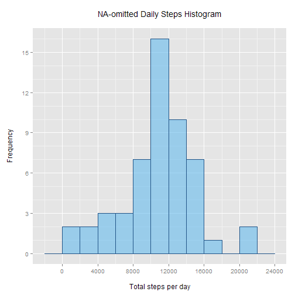
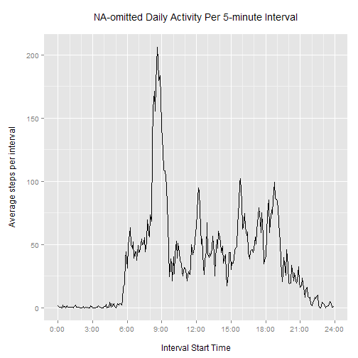
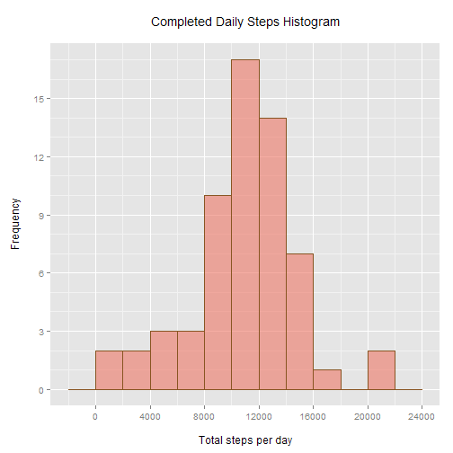
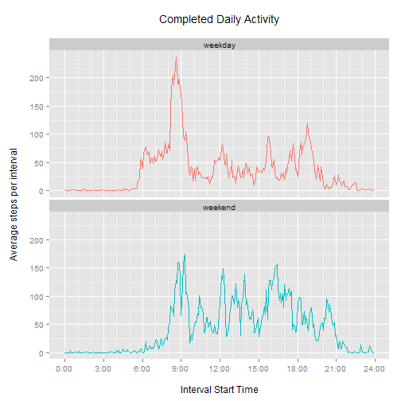

## Introduction  

Activity monitoring devices are growing in popularity, but the question of how to use and interpret the collected data remains somewhat open-ended.

In this article, we perform a case study using "number of steps" data from an anonymous individual collected during October and November, 2012. We'll attempt to answer a few basic questions with the aid of the **R language**.

To perform our data analysis and generate our figures, we'll make use of the following **R** libraries:


```r
  library(data.table)   # data
  library(ggplot2)      # graphics
  library(chron)        # handling dates
```

## Loading and preprocessing the data

The dataset is provided in `activity.csv`, a comma-delimited file archived within `activity.zip`.

We'll start by extracting and loading the data, if that hasn't been done already.


```r
  if(!file.exists("./activity.csv")) {
    unzip("./activity.zip") 
  }

  dt <- fread("./activity.csv", 
    colClasses = c("numeric", "character", "numeric")
  )
```
There are three variables in the data:

1. **steps:** Number of steps taken in a 5-minute interval (missing values are coded as `NA`), read as numeric
1. **date:** Date in `%Y-%m-%d` form, read as character.
1. **interval:** 5-minute interval identifier, read as numeric

In all, there are `17568` observations in the dataset.

First, let's clean this data by addressing an oddity in its format. The interval identifier is in *approximately* `%H%M` form, but the hour number is omitted when it is zero, and the minute number has no leading zeroes in the first hour. It's not readily dealt with by any standard R functions, and, if taken as a numeric axis, poses the problem of not all intervals being equal, as illustrated below:


```r
   head(dt$interval, 15)  
```

```
##  [1]   0   5  10  15  20  25  30  35  40  45  50  55 100 105 110
```

To fix this, we extract the hour and the minute using the quotient and remainder resulting from division by `100`. For purposes of this endeavor, we'll leave things comfortably simple and numeric:


```r
  # Preprocessing to adjust "interval" format to "true minutes from midnight".
  dt$interval <- (dt$interval %/% 100) * 60 + (dt$interval %% 100)
  
  # Check results.
  head(dt$interval, 15)
```

```
##  [1]  0  5 10 15 20 25 30 35 40 45 50 55 60 65 70
```

Later on, we'll manipulate and subset the data further as needed.

## What is mean total number of steps taken per day? 

We first consider the mean total steps taken per day. Initially, we will simply ignore any `NA` values in the data. In a later section, we'll revisit this decision. Note that throughout this assignment, we will be using `data.table` grammar.


```r
  # dt.total: Total steps per day, NA omitted.
  dt.total <- na.omit(dt)[, .(totalSteps = sum(steps)), by = date]
  
  # Histogram plot.
  ggplot(data = dt.total, aes(totalSteps)) +
    geom_histogram(
      binwidth = 2000,
      col = "#225588",
      fill = "#66bbee",
      alpha = 0.6
      ) +
    scale_x_continuous(
      breaks = seq(0, 24000, 4000)
    ) +
    scale_y_continuous(
      breaks = seq(0, 18, 3),
      minor_breaks = seq(0, 18, 1)
    ) +
    labs(title = "NA-omitted Daily Steps Histogram\n") +
    labs(x = "\nTotal steps per day", y = "\nFrequency")
```

 

`Total steps per day` has mean `10766.2` and median `10765`.

## Average daily activity pattern 

Next, we consider the average daily activity pattern -- that is, for each of the `288` five-minute intervals of the day, what was the average number of steps taken over the whole of the dataset? As before, we'll continue to ignore `NA` values.


```r
  # dt.daily: Average steps per interval, NA omitted.
  dt.daily <- na.omit(dt)[, .(avgSteps = mean(steps)), by = interval]
  
  # Time series plot.
  ggplot(data = dt.daily, aes(x = interval, y = avgSteps)) +
    geom_line() +
    scale_x_continuous(
      breaks = seq(0, 24 * 60, 180),
      minor_breaks = seq(0, 24 * 60, 60),
      labels = paste(
        seq(0, 24, 3),
        "00",
        sep = ":"
      )
    ) +
    labs(title = "NA-omitted Daily Activity Per 5-minute Interval\n") +
    labs(x = "\nInterval Start Time", y = "Average steps per interval\n")
```

 

```r
  # Calculate interval with max(avgSteps), and format as %H:%M.
  dt.daily.max <- dt.daily[which(dt.daily$avgSteps == max(avgSteps))]$interval
  
  dt.daily.max.output <- paste(
    sprintf("%02d", dt.daily.max %/% 60),
    sprintf("%02d", dt.daily.max %% 60),
    sep = ":"
  )
  
  # Paste together multiple "max" results in case of tie.
  if (length(dt.daily.max > 1)) {
    dt.daily.max.output <- do.call(paste, 
      list(dt.daily.max.output, collapse = ", ")
    )
  }
```

We find the 5-minute interval with the highest average steps over this dataset to be the one starting at `08:35`, with about `206.2` average steps.

## Imputing missing values

We now turn again to the question of missing values. In the original dataset, there were `2304` `NA` values. By omitting these from calculations, it's possible that our results were biased. What kind of biases, and what might we do about them?

First, let's try to see where our `NA` values are occurring by counting how many there are for each date that contains at least one `NA` value:


```r
  naRows <- which(is.na(dt))
  
  tapply(dt[naRows]$steps, dt[naRows]$date,
    function(e) {
      sum(is.na(e)) 
    }
  )  
```

```
## 2012-10-01 2012-10-08 2012-11-01 2012-11-04 2012-11-09 2012-11-10 
##        288        288        288        288        288        288 
## 2012-11-14 2012-11-30 
##        288        288
```

We observe that data is missing from several days completely (there are `288` intervals per day), and all other days are complete. 

A simple way to fill in the missing values is to use the mean interval value over the dataset. For our dataset, this would add `53` identical days that follow the overall mean activity pattern. The overall mean would be preserved exactly, and the median would be nudged toward, if not reach, the mean.

Another simple, but potentially more meaningful way of addressing `NA` values is to instead replace each one with with mean interval steps for the same day of week. This addresses the possibility that within the specific timeframe of the collected data, a relative omission of certain days of the week may be skewing both the average daily interval pattern, as well as the mean daily steps.

We'll look more closely at that possibility in the next section. For now, our `NA` imputing method is presented:


```r
  # Construct table of mean steps for each (dayWeek, interval) pair.
  dt$dayWeek <- strptime(dt$date, format = "%Y-%m-%d")$wday
  dt.intervals <- na.omit(dt)[, .(avgSteps = mean(steps)), by = .(dayWeek, interval)]
  
  # Work off a copy of original dataset.
  dt.complete <- copy(dt)
  
  # Build replacements vector by matching each NA row to dt.intervals row.
  naReplacements <- sapply(naRows,
    function(e) {
      dt.intervals[which(
        (dt.intervals$dayWeek == dt.complete[e]$dayWeek) &
        (dt.intervals$interval == dt.complete[e]$interval)
      )]$avgSteps
    }
  )
  
  # Perform replacement for the NA rows.
  dt.complete[naRows, steps := naReplacements]
```

Note that there was an assumption here that `na.omit(dt)` still contained every day of the week, ensuring that we would always have a valid NA value to impute. This may easily be verified:


```r
  length(unique(na.omit(dt)$dayWeek))
```

```
## [1] 7
```

It's worth also recognizing a limitation: this method is best when the dataset is large and there are more valid data points from which to calculate our interval averages. For the sake of completeness, here's a table of over how many days each of our imputed values was averaged:


```r
  na.omit(dt)[, .(num = length(unique(date))), by = dayWeek]
```

```
##    dayWeek num
## 1:       2   9
## 2:       3   8
## 3:       4   8
## 4:       5   7
## 5:       6   7
## 6:       0   7
## 7:       1   7
```

We now revisit the question posed in the first section -- *what is the total number of steps taken per day?* -- and evaluate it with our newly completed dataset `dt.complete` (which contains `0` `NA` rows).


```r
  # New data table for totalSteps by date.
  dt.complete.total <- dt.complete[, .(totalSteps = sum(steps)), by = date]

  # Histogram plot.
  ggplot(data = dt.complete.total, aes(totalSteps)) +
    geom_histogram(
      binwidth = 2000,
      col = "#885522",
      fill = "#ee7766",
      alpha = 0.6
      ) +
    scale_x_continuous(
      breaks = seq(0, 24000, 4000)
    ) +
    scale_y_continuous(
      breaks = seq(0, 18, 3),
      minor_breaks = seq(0, 18, 1)
    ) +
    labs(title = "Completed Daily Steps Histogram\n") +
    labs(x = "\nTotal steps per day", y = "Frequency\n")
```

 

Now `Total steps per day` has mean `10821.2` and median `11015`. To compare, the original results from the NA-omitted dataset were mean `10766.2` and median `10765`.

The impact is modest, with small upwards shifts in mean and median. This method of imputing `NA` values suggests that the missing dates produced a slight downwards bias by excluding observations from some of the days likely to have been more active in the dataset. It's important to caution that other methods may have painted a different picture, but for purposes of this assignment, the merits of the `NA` imputing method selected were secondary to its demonstration.

## Daily activity: weekdays versus weekends  

Continuing to work with the completed dataset, we return to revisit more broadly our earlier suggestion that activity patterns may be different for different days of the week. Here, we'll consider the difference in **weekday** and **weekend** observations for average daily activity per 5-minute interval.

To do this, we'll introduce a factor variable to `dt.complete` indicating whether each observation falls on a weekday or weekend. For convenience, we'll make use of the `chron` package's `is.weekend` function:


```r
  dt.complete$dayType <- as.factor(
    ifelse(is.weekend(dt.complete$date), 
      "weekend", 
      "weekday"
    )
  )
  
  dt.complete.daily <- dt.complete[, 
    .(avgSteps = mean(steps)), 
    by = .(interval, dayType)
  ]
```


```r
  # Time series plot with facets.
  ggplot(data = dt.complete.daily, aes(x = interval, y = avgSteps)) +
    geom_line(aes(color = dayType)) +
    facet_wrap(~dayType, ncol = 1) +
    labs(title = "Completed Daily Activity\n") +
    labs(x = "\nInterval Start Time", y = "Average steps per interval\n") +
    scale_x_continuous(
      breaks = seq(0, 24 * 60, 180),
      minor_breaks = seq(0, 24 * 60, 60),
      labels = paste(
        seq(0, 24, 3),
        "00",
        sep = ":"
      ) 
    ) +
    theme(legend.position = "none")
```

 

We observe distinct activity profiles on weekdays versus weekends. On weekdays, activity begins earlier and spikes heavily in the morning hours; on weekends, activity is distributed more evenly throughout the day. 

Finally, we would be remiss not to consider the interval and overall means in each case:


```r
  comparison <- dt.complete[, 
    .(avgSteps = mean(steps), dailySteps = mean(steps) * 24 * 60 / 5), 
    by = dayType
  ]
  
  comparison
```

```
##    dayType avgSteps dailySteps
## 1: weekday       36      10258
## 2: weekend       43      12407
```

On average, based on our completed dataset, weekend daily activity surpassed weekday daily activity by `2149` steps.

## Concluding statements

We've taken a brief stroll through the capability of **R** to evaluate, interpret, and modulate personal activity data. Though this is only the tip of the iceberg, we've demonstrated some of **R**'s potential in the burgeoning arena of the "quantified self". Happy continued exploring!

Feedback & comments are much appreciated, and I hope that you are similarly enjoying your experience in the *Data Science Specialization* track!  
  
